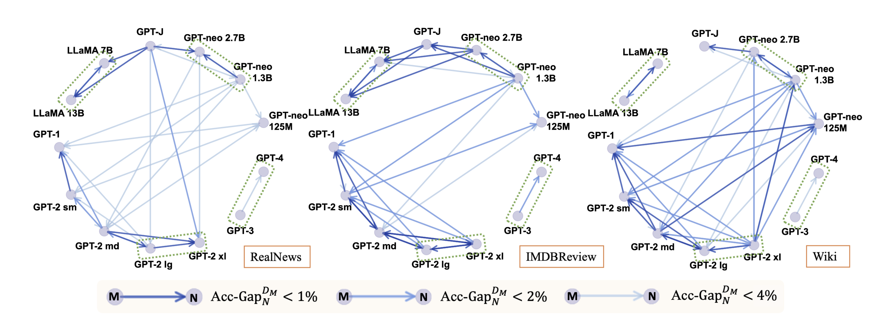

# On the Zero-Shot Generalization of Machine-Generated Text Detectors

This repository provides dataset and codes included in the EMNLP-finding 2023 paper [On the Zero-Shot Generalization of Machine-Generated Text Detectors](https://arxiv.org/abs/2310.05165)

Authors: Xiao Pu, Jingyu Zhang, Xiaochuang Han, Yulia Tsvetkov and Tianxing He

## Quick Links
- Dataset
    - Domains
    - Models
    - Hyperparameters

## A Dataset of Machine-Generated Text
Our introduced dataset is under this [directory](https://github.com/SophiaPx/detectors-generalization/tree/main/generation_data).

Each subset contains 5000 real-world human-written samples (labelled as 1) and 5000 machine-generated samples (labelled as 0), with a train/dev/test split ratio of 8:1:1.

### of 3 domains:
- news: [RealNews](https://huggingface.co/datasets/c4/viewer/realnewslike)
- reviews: [IMDBreview](https://huggingface.co/datasets/imdb)
- knowledge: [Wikipedia](https://huggingface.co/datasets/wikipedia/viewer/20220301.en)

### from 13 LMs:
|model|parameter|
| -- | -- |
|[GPT-1](https://huggingface.co/openai-gpt)|117M|
|[GPT-2 small](https://huggingface.co/gpt2)|124M|
|[GPT-2 medium](https://huggingface.co/gpt2-medium)|355M|
|[GPT-2 large](https://huggingface.co/gpt2-large)|774M|
|[GPT-2 xl](https://huggingface.co/gpt2-xl)|1.5B|
|text-davinci-003|175B|
|GPT-4|1.7T|
|[GPT-neo small](https://huggingface.co/EleutherAI/gpt-neo-125m)|125M|
|[GPT-neo medium](https://huggingface.co/EleutherAI/gpt-neo-1.3B)|1.3B|
|[GPT-neo large](https://huggingface.co/EleutherAI/gpt-neo-2.7B)|2.7B|
|[GPT-J](https://huggingface.co/EleutherAI/gpt-j-6b)|6B|
|LLaMA|7B|
|LLaMA|13B|

\* We finetune GPT1 and GPT2s on 5,000 human samples to make their generation more human-like. Because we find that text generated by these models in a zero-shot way are flooded with influent and repetitive sentences.

### Hyperparameters:
- top_p: 0.96
- top_k: 50
- temperature: 2.0 [^1]
[^1]: In order to make sure all the samples are of similar length, we regenerate samples if their number of tokens are out of range (100~120). Temperature is therefore set to 2 to avoid repetition of generation.